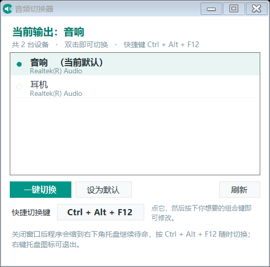

# 音频切换器(Audio Output Switcher)

一个 Windows 上"双击即用"的**音频输出设备切换小工具**:中文界面、免安装、托盘常驻,并且可以给**每台设备单独绑一个按键**——按下 `F1` 切音响、按下 `F2` 切耳机。



## 功能特点

- **双击列表即可切换**默认播放设备,当前正在使用的设备有圆点 + 加粗标记
- **一键切换**:在最近使用的两台设备之间来回切,默认快捷键 `Ctrl + Alt + S`
- **每台设备可绑定独立按键**:支持组合键,也支持**单个按键**(`F1`–`F12`、小键盘数字、方向键等)
- **托盘常驻**:关闭窗口不退出,快捷键照常在后台生效
- **开机自动启动**(可开关),而且程序换过文件夹后**启动项会自动跟随**
- **全中文界面**,免安装、绿色,不需要管理员权限、不写注册表、不常驻服务
- 附带**命令行模式**,方便写脚本或绑定到其他软件
- 自动处理设备插拔:插上/拔掉耳机后列表会自己刷新

## 快速开始

1. 下载 [`dist/音频切换器.exe`](dist/音频切换器.exe)(或者从 Releases 下载)
2. 双击运行,窗口里会列出你所有的播放设备
3. **双击**你要用的那台设备,它立刻成为默认输出
4. 之后按 `Ctrl + Alt + S`,就能在最近用过的两台设备之间来回切换

> 想"一键直达":选中一台设备 → 点「给选中设备设按键」→ 按 `F1`。之后按下 `F1` 就直接切到这台设备。
> 单个字母/数字也可以设,但会被系统全局独占(打字按到也会触发),所以程序会先弹窗确认。

详细使用说明见 [`docs/使用说明.md`](docs/使用说明.md)。

## 命令行用法

```
音频切换器.exe                 打开切换窗口(带托盘与快捷键)
音频切换器.exe --tray          仅驻留托盘,不显示窗口(开机自启用的就是它)
音频切换器.exe --toggle        立刻在最近两台设备间切换,然后退出
音频切换器.exe --set 耳机      按名称/序号切换到指定设备
音频切换器.exe --list          列出所有可用输出设备
```

## 配置文件

程序**不写注册表**,配置全部放在一个文本文件里:

```
%APPDATA%\AudioOutputSwitcher\config.ini
```

```ini
LastDeviceId={0.0.0.00000000}.{xxxxxxxx-xxxx-xxxx-xxxx-xxxxxxxxxxxx}
Hotkey=Ctrl+Alt+S
AutoStart=1
Key.{0.0.0.00000000}.{xxxxxxxx-...}=F1      # 每台设备绑定的按键
```

如果 `%APPDATA%` 不可写(例如放到只读目录里运行),程序会自动退回到"程序所在目录 → 系统临时目录"来保存配置。

## 从源码编译

只用系统自带的 .NET Framework 编译器,不需要装任何 SDK:

- 双击 `build.bat`(Windows),或
- 手动执行:

```bat
C:\Windows\Microsoft.NET\Framework64\v4.0.30319\csc.exe ^
  /nologo /target:winexe /optimize+ /platform:anycpu ^
  /win32icon:assets\icon.ico /out:dist\音频切换器.exe ^
  /r:System.dll /r:System.Core.dll /r:System.Drawing.dll /r:System.Windows.Forms.dll ^
  src\AudioOutputSwitcher.cs
```

源码是**单文件**的 C#(`src/AudioOutputSwitcher.cs`,约 1500 行,含中文注释),核心是调用 Windows 的 Core Audio API(`IMMDeviceEnumerator`)+ 未公开的 `IPolicyConfig::SetDefaultEndpoint` 来切换默认播放设备。

## 兼容性

| 项目 | 说明 |
| --- | --- |
| 系统 | Windows 10 / 11(x64、x86 均可) |
| 依赖 | .NET Framework 4.x(Win10/11 系统自带,无需安装) |
| 权限 | 普通用户即可,不需要管理员 |

## 常见问题

**点 × 之后程序去哪了?**
缩到了右下角托盘,继续在后台待命;右键托盘图标可以打开窗口、创建桌面快捷方式、设置开机自启或退出。

**快捷键没反应?**
多半是被别的程序占用了(聊天工具、截图软件常用 `Ctrl+Alt+*`)。点界面底部的「快捷切换键」重新按一个组合即可;程序也会提示是否被占用。

**切换后声音又跳回原来的设备?**
这是别的音频软件在抢默认设备——比如系统级音效软件、虚拟声卡驱动、声卡厂商的音效面板。把那些软件的"跟随/接管默认设备"选项关掉即可,不是本程序的问题。

**列表里出现"扬声器 (2)"这种重名设备?**
通常是某个音频驱动被安装过两次,系统留下了重复的设备记录。可以用 [`fix-duplicate-soundcard.ps1`](tools/fix-duplicate-soundcard.ps1) 清理(仅针对 SoundID/Sonarworks 虚拟声卡,不会碰其他设备)。

**会不会影响我的音量/音效设置?**
不会。程序只做一件事——切换默认播放设备,不碰音量、不碰音效、不修改音频驱动。

## 更新记录

**2026-09-25**

- 修复:窗口收起到托盘后快捷键失效(热键改为注册在独立的隐藏消息窗口上,不再受主窗口句柄重建影响)
- 修复:开机自启时如果音频设备尚未就绪,设备按键注册不到(现在每 20 秒自检并自动补注册)
- 新增:托盘图标在资源管理器重启后自动恢复
- 新增:开机启动项**自愈**——程序换过位置会自动改指新路径
- 新增:每台设备可单独绑定按键,支持单个按键

**2026-09-22**

- 首个版本:中文界面、托盘常驻、一键切换快捷键、开机自启、命令行模式

## 许可

MIT License,详见 [LICENSE](LICENSE)。
